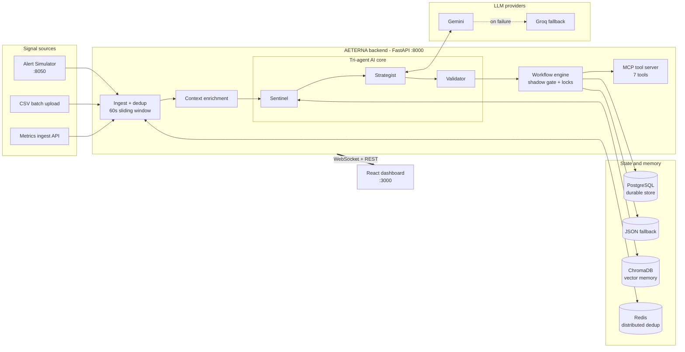
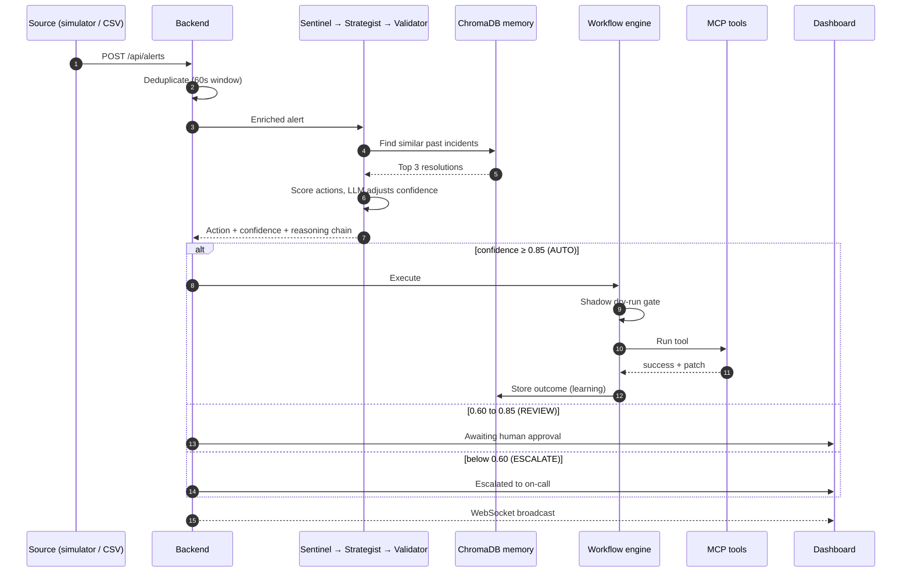
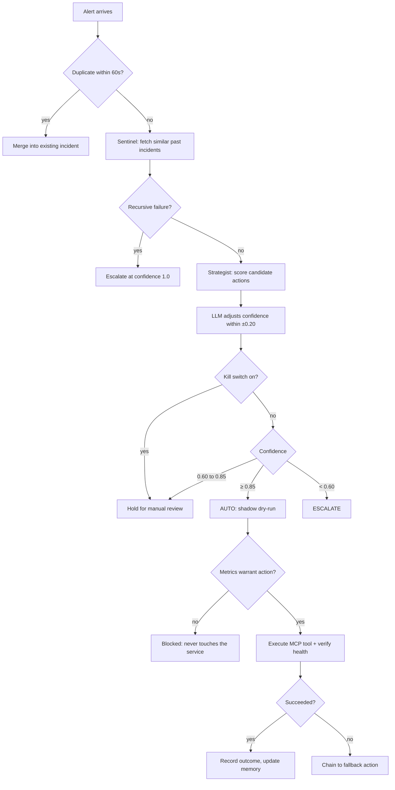

<div align="center">

# 🛡️ AETERNA

### Autonomous SRE Platform — detect, decide, act, and learn from every incident

*A tri-agent AI system that triages alerts, executes remediation through MCP tools, and gets smarter with every outcome.*

<br/>


**[Quick Start](#-quick-start)** · **[Architecture](#-architecture)** · **[How the AI decides](#-how-the-ai-decides)** · **[API](#-api-reference)** · **[Team](#-team)**

</div>

---

## 📖 Table of Contents

- [The problem](#-the-problem)
- [What AETERNA does](#-what-aeterna-does)
- [Key features](#-key-features)
- [Architecture](#-architecture)
- [How the AI decides](#-how-the-ai-decides)
- [Safety by design](#-safety-by-design)
- [Learning and prediction](#-learning-and-prediction)
- [Tech stack](#-tech-stack)
- [Quick start](#-quick-start)
- [Demo walkthrough](#-demo-walkthrough)
- [API reference](#-api-reference)
- [Project structure](#-project-structure)
- [Limitations and roadmap](#-limitations-and-roadmap)
- [Team](#-team)

---

## 🔥 The problem

Engineering teams drown in alerts. Most incident tooling is a static lookup table (`alert → action`) that ignores context, produces a storm of duplicate tickets for a single fault, never learns from past outcomes, and only reacts after something has already broken.

| Pain point | What it costs |
|---|---|
| Manual, repetitive incident handling | Slow response times, engineer burnout |
| Static rule-based mappings | Wrong or wasteful actions, no context awareness |
| Alert storms and duplicates | Noise that hides the real root cause |
| No memory of past incidents | The same failures repeat |
| Purely reactive | Downtime that could have been prevented |

## 💡 What AETERNA does

AETERNA closes the loop from **signal to resolution** without waiting for a human:

1. **Ingests** alerts and live metrics, and collapses duplicates into a single incident.
2. **Enriches** each signal with service state and similar past incidents retrieved from a vector memory.
3. **Decides** using a three-agent pipeline (Sentinel → Strategist → Validator) with an explicit, explainable confidence score.
4. **Acts** by executing the chosen remediation through a registry of MCP-style tools, gated by a shadow dry-run.
5. **Learns** from every outcome, including human corrections, so future decisions improve.

And when the AI isn't confident enough, it does not guess: it hands the incident to a human.

---

## ✨ Key features

<table>
<tr>
<td width="50%" valign="top">

### 🤖 Tri-agent AI core
**Sentinel** retrieves context, **Strategist** scores candidate actions, **Validator** decides whether to auto-execute, ask a human, or escalate. Every step is recorded as a visible reasoning chain.

### 🧠 RAG memory
Resolved incidents are stored as embeddings in ChromaDB. Similar past cases directly influence the next decision.

### ⚡ Smart deduplication
A 60-second sliding window (in-process, plus optional distributed Redis) turns alert storms into a single incident.

</td>
<td width="50%" valign="top">

### 🛠️ MCP action gateway
Seven remediation tools are registered as named MCP tools, returning structured `{success, patch, output}` results, which keeps execution auditable and swappable.

### 🔮 Predictive alerts
Trend analysis (regression slope, z-score, multi-metric correlation, peak-hour sensitivity) raises pre-emptive alerts before thresholds are breached.

### 🔴 Human override and kill switch
One call pauses all automation. Humans can override any AI decision, and that correction is fed back as a learning signal.

</td>
</tr>
<tr>
<td width="50%" valign="top">

### 🔍 Full explainability
Each incident shows the base score, history, similarity, risk and cost terms, plus the LLM's bounded adjustment and reason.

</td>
<td width="50%" valign="top">

### 📊 Live dashboard
Real-time WebSocket updates across seven views: dashboard, live incidents, services, AI intelligence, override, reports and audit, and workflow rules.

</td>
</tr>
</table>

---

## 🏗 Architecture



### Request lifecycle



---

## 🧭 How the AI decides

### 1. The three agents

| Agent | Responsibility |
|---|---|
| **Sentinel** | Pulls the top 3 most similar past incidents from vector memory. A recursive failure (the same fault recurring) short-circuits straight to escalation. |
| **Strategist** | Builds the candidate action list from the workflow table (or infers one via LLM, then a keyword heuristic, for unknown alert types), scores every candidate, and applies context boosts. |
| **Validator** | Turns the final confidence into an autonomy decision. |

### 2. The scoring model

Every candidate action receives a transparent, decomposable score:

```text
score = base_confidence × 0.40
      + historical_success × 0.25
      + similarity_to_past_fixes × 0.15
      − action_risk × 0.08
      − action_cost × 0.05
```

Context then adjusts it: a `scale_service` boost under high traffic, an `escalate` boost after repeated incidents, and a hard cap of `0.25` for any action that has been **deprioritized** after repeated failures. Finally, the LLM may nudge confidence by at most **±0.20**, so a language model can refine a decision but never dominate it.

### 3. Autonomy thresholds

| Final confidence | Mode | What happens |
|:---:|:---:|---|
| **≥ 0.85** | 🟢 `AUTO` | Approved and executed automatically |
| **0.60 – 0.85** | 🟡 `REVIEW` | Held for human approval |
| **< 0.60** | 🔴 `ESCALATE` | Escalated to a human immediately |



### 4. MCP action tools

| Tool | Purpose |
|---|---|
| `restart_service` | Restart the affected service |
| `scale_service` | Add capacity |
| `cleanup_logs` | Reclaim disk space |
| `switch_to_fallback` | Fail over to a fallback route |
| `restart_and_notify` | Restart and notify the owning team |
| `escalate` | Hand off to on-call |
| `manual_review` | Park for human inspection |

If an action fails, the engine chains to a fallback: `restart_service → scale_service → escalate`.

---

## 🔒 Safety by design

Autonomous systems are only useful if they are trustworthy. AETERNA layers its safeguards:

- 🧪 **Shadow execution gate**: before any action runs, a dry-run checks that current metrics actually warrant it. If the service already self-healed, the action is blocked.
- 🔐 **Per-service locking**: two workflows can never fight over the same service.
- 🎚️ **Bounded LLM influence**: the model adjusts confidence within ±0.20 and cannot pick actions outside the workflow table.
- 📝 **Hallucination and reliability log**: every LLM-assisted decision records the provider and the size of its adjustment.
- 🔴 **Global kill switch**: pause all automation instantly; incidents fall back to manual review.
- 👤 **Human override**: any decision can be corrected, and the correction is executed and learned from.
- 🧾 **Audit trail**: state transitions, overrides and kill-switch toggles are all logged.
- 🔑 **API-key auth**: every REST route and the WebSocket require a key.

---

## 📈 Learning and prediction

**Self-healing feedback loop.** Outcomes are tracked per `(alert_type, action)` pair. Actions that keep succeeding are ranked higher; actions that repeatedly fail are deprioritized. A human override counts as a failure signal against the AI's original pick, and the human's action is recorded as a fresh outcome.

**Predictive early warning.** For each service, a rolling metric history feeds a pattern detector that combines:

1. Linear-regression **slope** (rate of change)
2. **Z-score** anomaly against the rolling mean
3. **Multi-metric correlation** (CPU and error rate rising together)
4. **Peak-hour sensitivity** (lower thresholds during business hours)
5. **Velocity spikes** between consecutive readings

When a trend is heading toward a breach, AETERNA raises a `predictive_*` alert that maps to a pre-emptive action such as scaling.

---

## 🧰 Tech stack

| Layer | Technology |
|---|---|
| **Backend** | Python 3.12, FastAPI, Uvicorn, Pydantic, HTTPX, WebSockets |
| **AI** | Google Gemini (primary), Groq Llama 3.3 70B (fallback), custom tri-agent pipeline |
| **Memory** | ChromaDB vector store (RAG) |
| **Persistence** | PostgreSQL 16 with dual-write JSON fallback |
| **Dedup** | In-process sliding window + Redis 7 (optional, distributed) |
| **Execution** | Custom MCP-style tool registry, workflow engine |
| **Frontend** | React 19, Vite 8, Tailwind CSS 4, Framer Motion, React Router, Axios |
| **Infra** | Docker, Docker Compose |

---

## 🚀 Quick start

### Prerequisites

- [Docker](https://docs.docker.com/get-docker/) with the Compose plugin
- A free [Gemini API key](https://aistudio.google.com/app/apikey) and/or [Groq API key](https://console.groq.com/keys) *(optional: without keys, AETERNA falls back to deterministic scoring)*

### 1. Clone

```bash
git clone https://github.com/Pratikpantawane17/AETERNA-Autonomous-SRE-Platform.git
cd AETERNA-Autonomous-SRE-Platform
```

### 2. Configure environment

```bash
cp backend/.env.example backend/.env
cp alert-simulator/.env.example alert-simulator/.env
```

Open both files and paste in your API keys. The `.env` files are git-ignored and never committed.

### 3. Run everything

```bash
docker compose up --build
```

| Service | URL |
|---|---|
| 📊 Dashboard | http://localhost:3000 |
| ⚙️ Backend API | http://localhost:8000 |
| 📚 Interactive API docs | http://localhost:8000/docs |
| ❤️ Health check | http://localhost:8000/health |
| 🎛️ Alert Simulator | http://localhost:8050 |

Stop with `docker compose down`.

<details>
<summary><b>Run without Docker</b> (backend + frontend + simulator in three terminals)</summary>

<br/>

```bash
# Terminal 1: backend (falls back to local JSON storage without Postgres)
cd backend
python3 -m venv .venv && source .venv/bin/activate
pip install -r requirements.txt
DATABASE_URL="" REDIS_URL="" uvicorn main:app --port 8000 --reload
```

```bash
# Terminal 2: frontend (Vite prints the local URL, usually :5173)
cd frontend
npm install
npm run dev
```

```bash
# Terminal 3: alert simulator
cd alert-simulator
python3 -m venv .venv && source .venv/bin/activate
pip install -r requirements.txt
uvicorn web.app:app --port 8050
```

</details>

### 30-second smoke test

```bash
curl -X POST http://localhost:8000/api/alerts \
  -H "X-Api-Key: aeterna-demo-key" \
  -H "Content-Type: application/json" \
  -d '{"alert_type":"high_cpu","severity":"critical","service":"payment-service"}'
```

The response contains the incident, the chosen action, the confidence score, and the AI's reasoning chain.

### Configuration

| Variable | Purpose | Default |
|---|---|---|
| `AETERNA_API_KEY` | Key required on every API call (`X-Api-Key` header) | `aeterna-demo-key` |
| `GEMINI_API_KEY` | Primary LLM | none |
| `GEMINI_API_MODEL` | Gemini model name | `gemini-2.0-flash` |
| `GROQ_API_KEY` | Fallback LLM | none |
| `GROQ_MODEL` | Groq model name | `llama-3.3-70b-versatile` |
| `DATABASE_URL` | PostgreSQL connection (optional) | set in Docker |
| `REDIS_URL` | Redis for distributed dedup (optional) | set in Docker |

---

## 🎬 Demo walkthrough

1. **Upload a CSV.** Open the dashboard → **Reports** → *CSV Batch Upload*, then drop in `sample_alerts.csv` (included). Incidents appear in real time.
2. **Watch the live dashboard.** Severity charts, alert-type breakdown, MTTR and automation rate update over WebSocket.
3. **Inspect an incident.** Open **Live Incidents**, click any incident to see the AI reasoning, confidence score and action taken.
4. **Override the AI.** Use **Human Override** to approve or reject a decision and watch the learning signal recorded.
5. **Run a live simulation.** Open the simulator at `:8050`, press **Start Simulation**, or use **AI Generate** with a prompt like *"database deadlock"*.
6. **Explore intelligence.** **AI Intelligence** shows predictive alerts and explainability. **Reports** has the weekly digest, hallucination log and audit trail.

<details>
<summary><b>CSV format</b></summary>

<br/>

```csv
alert_type,severity,service
high_cpu,critical,payment-service
disk_full,high,db-cluster
api_failure,medium,auth-service
```

**Required:** `alert_type`, `severity`, `service`. **Optional:** `timestamp`.
**Severities:** `critical`, `high`, `medium`, `low`, `info`.
**Built-in alert types include:** `high_cpu`, `disk_full`, `api_failure`, `service_down`, `memory_leak`, `high_memory`, `high_latency`, `high_error_rate`, `network_timeout`, `db_connection`, `crash_loop`, `repeated_failure`, `oom_kill`, `pod_eviction`, `health_check_fail`, `rate_limit`, `dependency_down` and more. Unknown types are handled by LLM inference with a heuristic fallback.

Batch uploads skip the per-alert LLM call so large files process quickly.

</details>

<!--
📸 SCREENSHOTS: add your own images to docs/screenshots/ and uncomment this block.

## 🖼 Screenshots

| Dashboard | Incident reasoning |
|:---:|:---:|
|  |  |
-->

---

## 📡 API reference

All `/api/*` routes require the header `X-Api-Key: <your key>`. The WebSocket takes it as `?api_key=`.

<details>
<summary><b>View all endpoints</b></summary>

<br/>

| Method | Endpoint | Description |
|:---:|---|---|
| `GET` | `/health` | Service health and LLM availability |
| `WS` | `/ws` | Live event stream |
| `POST` | `/api/alerts` | Submit an alert |
| `POST` | `/api/alerts/upload-csv` | Batch-submit alerts from a CSV |
| `GET` | `/api/alerts` | List alerts |
| `POST` | `/api/ingest/metrics` | Ingest service metrics |
| `GET` | `/api/incidents` | List incidents |
| `GET` | `/api/incidents/{id}` | Incident details and reasoning |
| `POST` | `/api/incidents/{id}/override` | Human override |
| `GET` | `/api/incidents/{id}/postmortem` | LLM-generated postmortem |
| `GET` / `POST` | `/api/workflows` | List workflow rules or add a new one |
| `GET` | `/api/dashboard/stats` | Dashboard statistics |
| `GET` | `/api/services/state` | Current service state |
| `POST` | `/api/predict` | Predict a breach from metric history |
| `GET` / `POST` | `/api/kill-switch` | Read or toggle the global kill switch |
| `GET` | `/api/reliability/hallucinations` | LLM reliability log |
| `GET` | `/api/audit` | Audit trail |
| `GET` | `/api/overrides` | Human override history |
| `GET` | `/api/learning/updates` | Learning loop updates |
| `GET` | `/api/reports/weekly-digest` | Weekly digest |

Full interactive docs are served at `/docs` when the backend is running.

</details>

---

## 📁 Project structure

<details>
<summary><b>View the repository layout</b></summary>

<br/>

```text
AETERNA-Autonomous-SRE-Platform/
├── docker-compose.yml          # Postgres, Redis, backend, frontend, simulator
├── README.md
├── sample_alerts.csv           # Demo alerts for the CSV upload flow
├── test_upload.py              # Upload test script
│
├── backend/                    # FastAPI service
│   ├── main.py                 # API routes, WebSocket, triage + dispatch
│   ├── ai_core.py              # Sentinel, Strategist, Validator, LLM calls
│   ├── workflow_engine.py      # Shadow gate, per-service locks, fallback chain
│   ├── mcp_server.py           # MCP tool registry (7 tools)
│   ├── memory.py               # ChromaDB memory, pattern detection, prediction
│   ├── stream_processor.py     # Ingestion and deduplication
│   ├── storage.py              # Postgres + JSON persistence, default workflows
│   ├── models.py               # Typed Alert / Incident schemas
│   └── .env.example
│
├── frontend/                   # React + Vite dashboard
│   └── src/
│       ├── pages/              # Dashboard, Incidents, Services, Intelligence,
│       │                       # Override, Reports, Workflows
│       ├── components/         # dashboard, incidents, intelligence, services,
│       │                       # override, controls, layout, ui
│       ├── hooks/              # WebSocket and stats hooks
│       ├── context/            # System-wide state
│       └── config/             # API client and constants
│
└── alert-simulator/            # Alert generator (web UI + CLI)
    ├── simulator/              # Generators, AI alert generation, CLI
    ├── web/                    # Simulator dashboard
    └── scripts/                # Load test and mock core
```

</details>

---

## 🧭 Limitations and roadmap

AETERNA is a hackathon-built prototype, so here is what it does and doesn't do today.

**Current scope**

- Remediation tools operate on a **simulated service-state layer**. They demonstrate the full detect → decide → act → verify loop, but they do not yet call real infrastructure APIs.
- The workflow table is seeded with 20+ alert types; unknown types fall back to LLM/heuristic inference.

**Roadmap**

- [ ] Real connectors for Kubernetes, cloud providers and PagerDuty
- [ ] Ingestion of logs and traces alongside metrics
- [ ] Multi-region deployment with Kafka and a Redis cluster
- [ ] Reinforcement learning from human override feedback
- [ ] Auto-generated runbooks
- [ ] Predictive capacity planning

---

## 👥 Team

Built by **ByteCoders** for the **WSI AI-thon 2026** hackathon, on the problem statement *AI-Driven Automation Workflows*.

| Name | Role |
|---|---|
| **Pratik Pantawane** | Team Lead |
| **Arth Rai** | Team member |
| **Sanskar Sontakke** | Team member |
| **Siddhi Sapkal** | Team member |

---

<div align="center">

If you found this project interesting, consider giving it a ⭐

**Built with ❤️ by ByteCoders**

</div>
